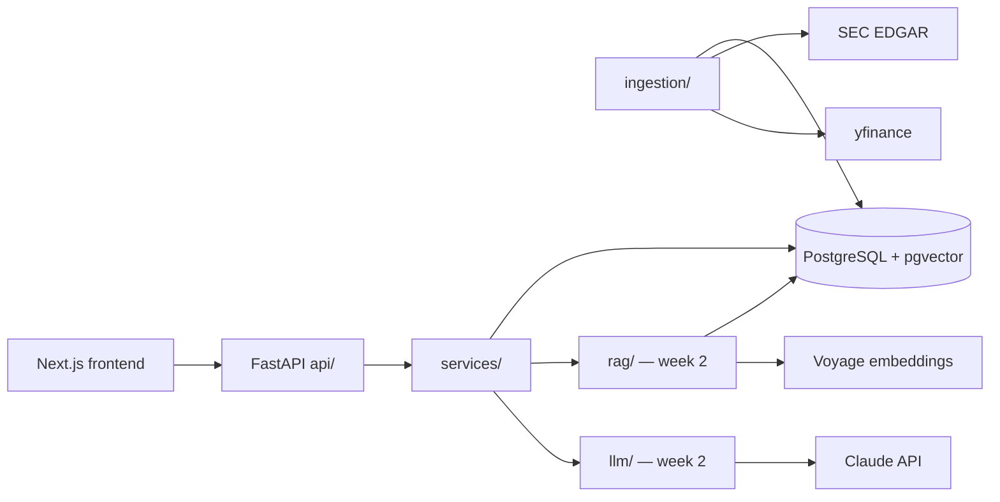

# Architecture

## Overview

EquityLens is a modular monolith: one FastAPI service, one Postgres database
(with pgvector), one deployable unit. Module boundaries inside `backend/app/`
are strict so pieces could be split out later if ever needed:

## Modules

| Module | Responsibility |
|---|---|
| `api/` | HTTP routes and Pydantic DTOs. No business logic. |
| `services/` | Business logic: queries, ingestion orchestration, upserts. |
| `ingestion/` | Vendor clients and payload normalization. Pure functions where possible so they are unit-testable without network. |
| `models/` | SQLAlchemy schema. Matched 1:1 by handwritten Alembic migrations. |
| `rag/` (week 2) | Chunking, embedding, retrieval, citation validation. |
| `llm/` (week 2) | Claude client, versioned prompts, model tiering. |

## Key design points

- **Idempotent ingestion.** Every ingestion job uses `INSERT … ON CONFLICT`,
  so the failure-recovery story is "run it again". No job state to clean up.
- **Long/narrow fundamentals table.** XBRL concepts vary per company; a wide
  table would grow a column per concept. One row per
  (company, metric, fiscal year, fiscal period) instead.
- **Filings as a state machine.** `ingest_status` walks
  pending → parsed → chunked → embedded (or failed), so partially processed
  filings are visible and resumable.
- **One database for relational + vectors.** pgvector instead of a separate
  vector store — see [decision 0002](decisions/0002-pgvector-over-dedicated-vector-store.md).
